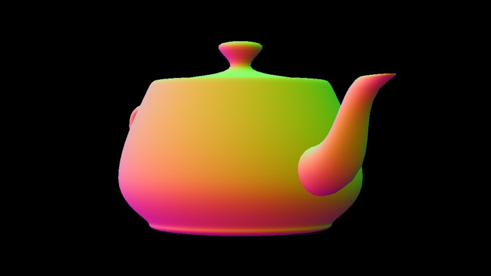

# poli-gon

Cross-platform 3D graphics library for Rust fueled by WebGPU. Use it on native
environments or the Web with WebAssembly.

[Read the docs][docs]

[docs]: https://zachnguyen.com/poli_gon

Work in progress. Due for release on <https://crates.io> soon.

